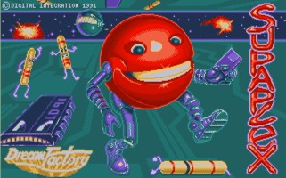

### DASH_GAME - JS SUPAPLEX reincarnation

## Supaplex -

is a video game created by Philip Jespersen and Michael Stopp, two Swiss students, and published by Digital Integration in 1991. It is an extended clone of Boulder Dash.

[More on Wiki](https://en.wikipedia.org/wiki/Supaplex)
